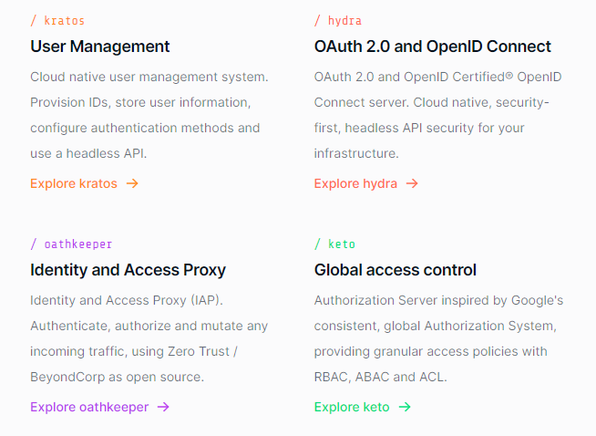

This project seeks to be a top-shelf reference project for developers looking to get started with the Ory Identity Management Platform. 


## Ory Identity Management
The Ory identity management platform is an open-source ecosystem designed to provide scalable, secure, and customizable identity and access management solutions. It offers a modular approach to managing authentication, authorization, and policy enforcement. The major components include:

Kratos: Identity and user management system focused on self-service user experiences, including registration, login, profile management, and password recovery supporting integrations with external identity providers.

Hydra: OAuth 2.0 and OpenID Connect (OIDC) server for managing secure authorization and authentication.

Keto: A flexible access control management system that provides fine-grained authorization policies for complex systems.

Oathkeeper: Zero-trust access proxy that enforces authentication and authorization policies for APIs and web applications.

Self-Service UI: A customizable frontend interface for user-facing workflows like registration, login, and profile management.


## Acknowledgements
The initial Docker Configuration was originally taken from: https://hamgit.ir/open.source/micro 

## How to use?
```
docker compose up
```

## Architecture




## Still needs to be done
- [ ] revamp the Kratos and Hydra configurations
- [ ] create additional maintenance scripts to assist in testing and development
- [ ] create test data sets and scripts/jobs to load the seed data
